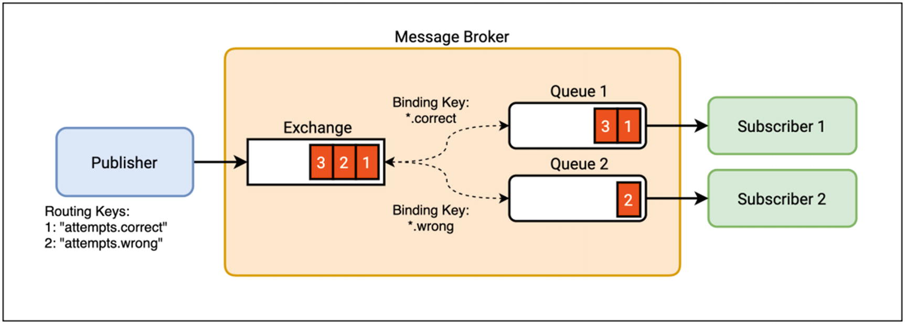
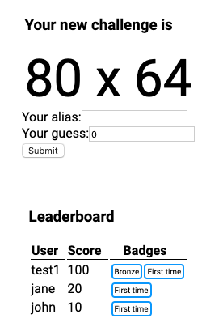

# Learn Microservices with Spring Boot - Chapter 7

This repository contains the source code of the practical use case described in the book [Learn Microservices with Spring Boot (2nd Edition)](https://tpd.io/book-extra).

The book follows a pragmatic approach to building a Microservice Architecture. You start with a small monolith and examine the _pros_ and _cons_ that come with a move to microservices. 

## Chapter 7 version

In Chapter 7, you learn how to achieve loose coupling with an Event-Driven Architecture using a **RabbitMQ message broker**. Besides, you go through the extra advantages like the ability to implement different messaging patterns, load balancing, and resilience. 


The main components of the AMQP protocol implemented by RabbitMQ is shown below:


The main concepts included in this chapter are:

* Event-Driven Architectures: Pros and Cons
* Embracing Eventual Consistency, all the way up to the UI (see ["Data Consistency in Microservices Architecture"](https://medium.com/garantibbva-teknoloji/data-consistency-in-microservices-architecture-5c67e0f65256))
* RabbitMQ main concepts, messaging patterns, and practical implementation
* Refactoring the microservices towards an Event-Driven strategy
* Resilience with persistent messages

As usual, the book uses this practical implementation to teach you why introducing a message broker between our microservices is a good idea. You learn the patterns before the tools, so you can use your knowledge to build similar architectures using a different technology stack - e.g. Kafka. 

Check the [Book's Web Page](https://tpd.io/book-extra) to see the complete list of chapters.

## Running the app

Requirements:

* JDK 14+
* Node.js v13.10+
* npm 6.13.7+
* RabbitMQ 3.8.3+

1. You need a RabbitMQ server running. Run the server according to the instructions for your OS, for example:
    ```bash
    $ rabbitmq-server
    ```
2. You can access the RabbitMQ server at http://localhost:15672. The default user is "guest" and the passowrd is "guest".
3. To start the Multiplication microservice, you can use the command line with the included Maven wrapper  (See [Spring Boot Maven Plugin Documentation: Goals](https://docs.spring.io/spring-boot/docs/current/maven-plugin/reference/htmlsingle/#goals)):
    ```bash
    multiplication$ ./mvnw spring-boot:run
    ```
4. To test the REST I/F:
    ```bash
    multiplication$ curl -XGET http://localhost:8080/attemps?alias=  | json_pp    
    multiplication$ curl -XPOST http://localhost:8080/attemps \
    --header 'content-type: application/json' \
    --data-raw '{ "factorA":"30", "factorB":"40", "userAlias":"toto", "guess":"1200" }' | json_pp     
    multiplication$ curl -XGET http://localhost:8080/challenges/random | json_pp
    multiplication$ curl -XGET http://localhost:8080/users/{idList} | json_pp     
    ```
5. To start the Gamification microservice, you do the same from its corresponding folder:
    ```bash
    gamification$ ./mvnw spring-boot:run
    ```
6. To test the REST I/F:
    ```bash
    gamification$ curl -XGET http://localhost:8081/leaders | json_pp
    ```
7. The React application can be started with npm. First, you need to download the dependencies with:
    ```bash
    challenges-frontend$ npm install
    ```
8. Then, you start the server with:
    ```bash
    challenges-frontend$ npm start
    ```

Once the backend and the fronted are started, you can navigate to `http://localhost:3000` in your browser and start resolving multiplication challenges. This time, you'll see the Leaderboard.



## Questions

* Do you have questions about how to make this application work?
* Did you get the book and have questions about any concept explained within this chapter?
* Have you found issues using updated dependencies?

Don't hesitate to create an issue in this repository and post your question/problem there. 

## About the book

Are you interested in building a microservice architecture from scratch? You'll face all the challenges of designing and implementing a distributed system one by one, and will be able to evaluate if it's the best choice for your project.

Visit [https://tpd.io/book-extra](https://tpd.io/book-extra) for all the details about the book.

### Purchase

You can **buy the book online** from these stores:

* [Apress](https://www.kqzyfj.com/click-8535631-14029332?url=https%3A%2F%2Fwww.apress.com%2Fgp%2Fbook%2F9781484261309)
* [Amazon](https://amzn.to/3nADn4q)
* and other online stores, check the IBAN (9781484261309) on [google](https://www.google.com/search?q=9781484261309)

### Source code by chapter (all repositories are available on Github)

* [Chapter 3. A professional 3-tier 3-layer Spring Boot app](https://github.com/Book-Microservices-v2/chapter03)
* [Chapter 4. Building a basic frontend in React (backender-friendly)](https://github.com/Book-Microservices-v2/chapter04)
* [Chapter 5. The Data Layer Concepts and Spring Data JPA](https://github.com/Book-Microservices-v2/chapter05)
* [Chapter 6. Starting with Microservices - Synchronous](https://github.com/Book-Microservices-v2/chapter06)
* [Chapter 7. Event-Driven Architectures - Making our system asynchronous](https://github.com/Book-Microservices-v2/chapter07)
* [Chapter 8 (I). The Gateway Pattern in Microservice Architectures (Spring Cloud Gateway)](https://github.com/Book-Microservices-v2/chapter08a)
* [Chapter 8 (II). Service Discovery and Load Balancing for Spring Boot Microservices (Consul / Spring Cloud Load Balancer)](https://github.com/Book-Microservices-v2/chapter08b)
* [Chapter 8 (III). Centralized Configuration with Consul KV](https://github.com/Book-Microservices-v2/chapter08c)
* [Chapter 8 (IV). Centralized Logs, Distributed Tracing, and Containerization with Docker (Buildpacks) and Docker Compose](https://github.com/Book-Microservices-v2/chapter08d)

Extra chapters:

* [E.1. End-to-End Microservice tests with Cucumber](https://github.com/Book-Microservices-v2/cucumber-tests)
* [U.2.4.0. Upgrade: Spring Boot 2.4.0, Cloud 2020.0, Java 15](https://github.com/Book-Microservices-v2/update-2.4.0)
